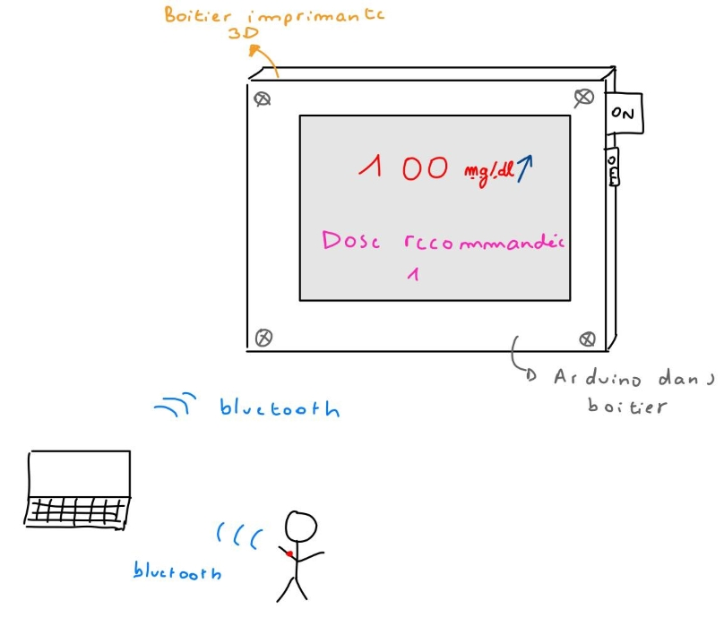

# Accessible Glucose Monitoring Display  
## 1. Introduction

This project focuses on improving the accessibility of diabetes management technologies for elderly individuals. Despite technological progress, many older patients find modern devices, particularly those that depend on smartphones and computers, difficult to use. These systems often assume a degree of digital literacy that many users lack, creating barriers to proper healthcare management.

Our objective was to design and prototype an **independent, user-friendly display system** for continuous glucose monitoring (CGM) data. The device collects information from a glucose sensor and presents it on a simple screen that can be understood without any additional technology or external software.

The guiding question behind our work was:

 **How can diabetes management devices be made more accessible to older individuals while ensuring they remain effective, user-friendly, and affordable?**

We aimed to create a low-cost, standalone unit that displays key glucose-related information clearly and intuitively, helping patients make informed decisions about their care without needing to use a smartphone or laptop.

---

## 2. Context and Problem Definition

During our initial research, we identified several factors preventing older individuals from adopting newer medical technologies:

- **Financial limitations:** Modern medical devices and their consumables can be prohibitively expensive.  
- **Health literacy barriers:** Complex interfaces and terminology often make digital health devices inaccessible.  
- **Dependence on external devices:** Many systems rely on mobile applications or cloud services.  
- **Limited technical support:** Users often receive insufficient training to handle configuration and troubleshooting.  
- **Lack of ergonomic design:** Devices may be too small or feature cluttered screens that reduce readability.  

The combination of these issues results in a significant digital and healthcare divide, leaving many individuals dependent on older, less efficient devices.

---

## 3. Concept and Functional Objective

Our proposed solution is a **Blood Glucose Display Unit** that connects to a CGM and displays real-time glucose information using a simple LED or TFT screen. The interface provides:

- A **directional arrow** showing glucose trends (rising, falling, or stable).  
- The **current glucose value** in mg/dL.  
- A **recommended insulin dosage** based on recent data.  
- A **graph of glucose evolution** over the last several hours.  

Once configured, the device operates autonomously and updates continuously without user intervention. The overall goal was to combine **affordability, reliability, and simplicity** in one unit.

### Concept Sketch


---

## 4. System Architecture

The system’s operation can be summarized in four stages:

1. **Data Collection:** Glucose data is obtained from a continuous glucose monitor (CGM).  
2. **Transmission:** The data is sent via Bluetooth to a microcontroller.  
3. **Processing:** The microcontroller interprets the incoming data stream and converts it into readable metrics.  
4. **Display:** Information is shown on a TFT screen in a compact 3D-printed enclosure.

### Chosen Components

| Component | Purpose | Reason for Choice |
|------------|----------|-------------------|
| **Raspberry Pi Pico WH** | Main microcontroller | Integrated Bluetooth, affordable (~9€) |
| **2.4-inch ILI9341 TFT Touchscreen** | Display unit | Compatible with Arduino/Pico, low power |
| **3D-Printed Enclosure** | Structural housing | Customizable and low cost |
| **Arduino Uno** | Alternative testing platform | Stable screen interface for debugging |

---

## 5. Hardware Development

### 5.1 Initial Hardware Integration

The initial prototype used a **Raspberry Pi Pico WH** to receive CGM data via Bluetooth. The display used the **ILI9341 SPI-based screen**, providing enough resolution for numeric and graphical information. However, during early testing, we encountered connection issues between the Pico and the screen, specifically in managing the SPI interface timing and voltage logic levels.


After several unsuccessful attempts to achieve consistent data transmission and display output, the team decided to use an **Arduino Uno** as an alternative controller to simplify the debugging process. This substitution allowed for direct hardware control and immediate feedback during testing.

---

### 5.2 3D Enclosure Design and Fabrication

The enclosure was designed using **OpenSCAD**, which provided parametric control over dimensions and cutouts. The design went through several iterations to optimize fitting, assembly, and internal cable routing. The main design parameters are shown below.

#### OpenSCAD Sample Code

```openscad
// Parameters for the open box
box_length = 92;
box_width = 65;
box_height = 55;

// Inner structure
inner_length = 82;
inner_width = 55;
inner_height = 50;

// Screen opening
screen_length = 61;
screen_width = 44;

// Small side hole
small_hole_width = 10;
small_hole_height = 10;

// Assembly
difference() {
    cube([box_length, box_width, box_height]);
    translate([(box_length - inner_length) / 2, (box_width - inner_width) / 2, 0])
        cube([inner_length, inner_width, inner_height]);
    translate([(box_length - screen_length) / 2, (box_width - screen_width) / 2, 0])
        cube([screen_length, screen_width, box_height]);
    translate([(box_length - screen_length) / 2 - small_hole_width, (box_width - small_hole_height) / 2, 0])
        cube([small_hole_width, small_hole_height, box_height]);
}
```

Several prototypes were printed and tested to ensure proper fit between the screen, the control board, and the front panel. Adjustments were made for screw placements and cable access.


The final enclosure version was compact, with accessible openings for power and data cables, while maintaining an ergonomic shape suitable for a desktop display.

---

## 6. Software and Data Processing

### 6.1 Data Analysis and Visualization with MicroPython

Before integrating the electronics, we developed a MicroPython script to analyze and visualize glucose data from CSV files produced by a CGM. This program reads timestamped glucose readings, filters the last 24 hours of data, and produces both textual summaries and plots.

```python
import pandas as pd
import matplotlib.pyplot as plt 

file_path = 'glucose_data.csv'
data = pd.read_csv(file_path, header=1)
data['Device Timestamp'] = pd.to_datetime(data['Device Timestamp'], format='%d/%m/%Y %H:%M')

# Filter last 24 hours
twenty_four_hours_ago = data['Device Timestamp'].max() - pd.DateOffset(hours=24)
selected_data = data[data['Device Timestamp'] >= twenty_four_hours_ago]

# Convert glucose to mg/dL
sel_gluc_mg = selected_data['Historic Glucose mmol/L'] * 18

plt.plot(selected_data['Device Timestamp'], sel_gluc_mg, color='blue')
plt.ylabel('Glucose (mg/dL)')
plt.xlabel('Time (hours)')
plt.title('Blood Glucose Levels (Last 24 Hours)')
plt.savefig('graph.png')
plt.show()
```

This allowed validation of the data pipeline before embedding it into the microcontroller logic.

---

### 6.2 Display Control Using Arduino C++

Once data visualization was validated, the focus shifted to programming the display output. Using the **UTFTGLUE library**, we implemented a dynamic visualization that plots glucose trends and indicates current values through colors (green for safe, yellow for moderate, red for high).

#### Simplified C++ Snippet

```cpp
#include <UTFTGLUE.h>
UTFTGLUE myGLCD(0, A2, A1, A3, A4, A0);

void setup() {
  myGLCD.InitLCD();
  Serial.begin(9600);
}

void loop() {
  int glucose = random(80, 150);
  myGLCD.clrScr();
  myGLCD.setFont(BigFont);
  myGLCD.print("Glucose:", 30, 50);
  myGLCD.printNumI(glucose, 160, 50);
  myGLCD.print("mg/dL", 210, 50);
  delay(5000);
}
```

This code simulates glucose readings and displays them in a readable format. The color scheme and layout were optimized for clarity and visibility.

---

## 7. Experimental Results

### 7.1 Final Prototype Assembly

After integrating all components, the final device successfully displayed glucose readings and color-coded trends. While Bluetooth data acquisition was not fully operational by the end of the project, the wired prototype proved that the concept was technically feasible.

#### Final Assembly and Display


#### Display Graph Example


#### Normal Glucose Level Display


#### High Glucose Level Display


---

## 8. Technical Challenges and Resolutions

1. **Bluetooth Integration Failure:**  
   The Raspberry Pi Pico WH faced intermittent Bluetooth communication problems when paired with the CGM simulator. This led to the switch to an Arduino Uno for local testing.  

2. **Screen Driver Compatibility:**  
   Initial mismatches between screen libraries caused blank display outputs. Updating to the UTFTGLUE driver resolved communication issues.  

3. **Power and Voltage Stability:**  
   The TFT screen required stable 5V power. An initial USB supply was insufficient, leading to voltage drops that froze the screen. The issue was fixed with an external regulated power adapter.  

4. **Mechanical Alignment:**  
   Misalignment of the screen’s cutout in early enclosure versions required design correction in OpenSCAD. An additional millimeter was added to fit tolerances after several print iterations.  


---

## 9. Discussion and Future Improvements

The final prototype demonstrated that an independent glucose display is technically feasible using low-cost components. To further improve the design:

- Implement a **dedicated API** for real-time CGM data synchronization.  
- Transition to **battery-powered operation** with onboard data storage.  
- Redesign the enclosure for **ease of assembly** and **mass production**.  
- Integrate audible or tactile feedback for accessibility.  

These improvements would transform the prototype into a practical, deployable medical-assistive device.

---

## 10. Conclusion

The project successfully delivered a functional prototype of a **low-cost, standalone glucose monitoring display** designed for elderly users. Through several iterations of hardware, software, and mechanical design, the team achieved a proof-of-concept system that effectively demonstrates the potential for simplified health monitoring solutions.

This work provided practical experience in interdisciplinary engineering, encompassing:
- Microcontroller programming  
- Data visualization  
- Digital fabrication (3D printing)  
- Hardware troubleshooting and system integration  

Although the prototype remains a preliminary model, it represents a meaningful step toward improving medical device accessibility for all users.

---
